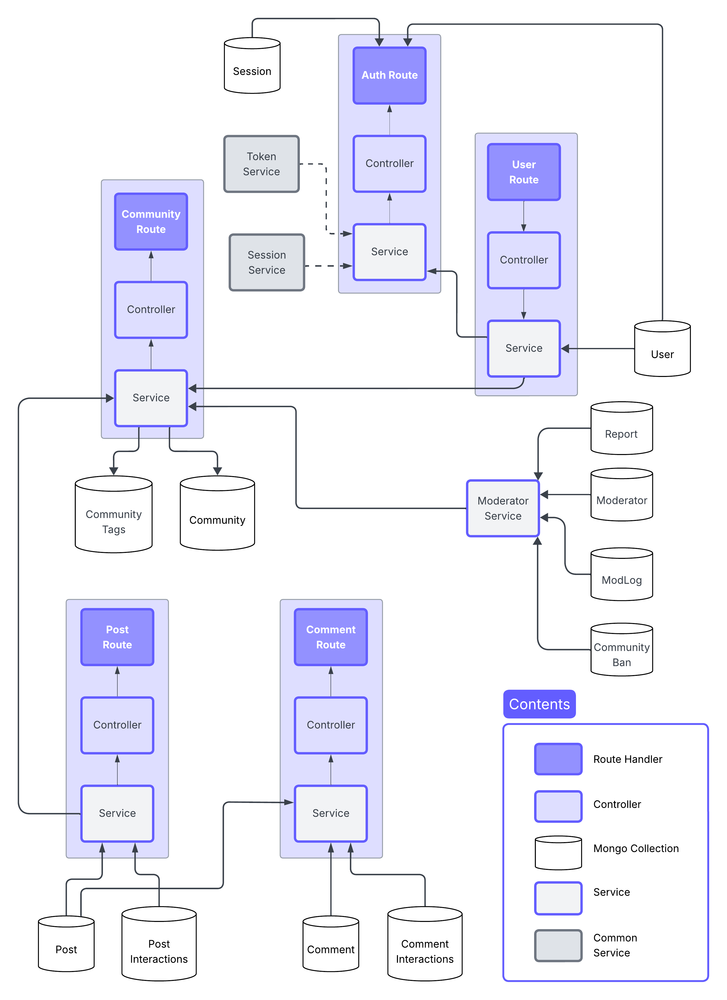

# Sync Backend - Architecture Documentation

This document describes the architectural design of the Sync social media platform backend. The application follows Domain-Driven Design principles with a clean architecture approach to ensure maintainability, scalability, and separation of concerns.

## Overview



Sync Backend uses a modular architecture with clear separation between controllers, services, and data models. It follows RESTful API design principles and utilizes the following tech stack:

- **Go 1.24.2+** - Core programming language
- **Gin Framework** - HTTP router and middleware
- **MongoDB** - Primary database for social content
- **Redis** - Caching and session management
- **PostgreSQL** - Geolocation services

## Core Architecture Patterns

### 1. Domain-Driven Design (DDD)

Business logic is organized by domain in the `api/` directory, with each subdomain (auth, user, post, comment, community) having its own set of controllers, services, and models. This ensures that related functionality is grouped together and can evolve independently.

### 2. Clean Architecture

The application follows clean architecture principles with distinct layers:

- **Controllers** - Handle HTTP requests and responses
- **Services** - Contain business logic and orchestrate operations
- **Models** - Define data structures and MongoDB schemas
- **DTOs (Data Transfer Objects)** - Handle data transfer between layers

### 3. Dependency Injection

The application uses constructor-based dependency injection to provide services with their required dependencies, making testing and maintenance easier.

## Directory Structure

```
sync-backend/
├── api/                  # API components organized by domain
│   ├── auth/             # Authentication (login, signup, OAuth)
│   ├── comment/          # Comment functionality and reactions
│   ├── common/           # Shared services (location, analytics)
│   ├── community/        # Community creation and management
│   ├── post/             # Post creation and interaction
│   ├── user/             # User profiles and relationships
│   └── system/           # System-wide operations
├── arch/                 # Core architecture components
│   ├── application/      # App bootstrapping and configuration
│   ├── mongo/            # MongoDB integration layer
│   ├── postgres/         # PostgreSQL integration
│   ├── redis/            # Redis caching and storage
│   ├── network/          # HTTP networking layer
│   └── middleware/       # Global middleware (errors, rate limiting)
├── configs/              # Configuration files (YAML)
├── scripts/              # Deployment and maintenance scripts
├── seed/                 # Seed data for initial setup
├── test/                 # Testing utilities
├── uploads/              # File upload storage location
└── utils/                # Helper utilities and tools
```

## Components In Detail

### API Layer (api/)

Each domain module in the API layer follows a consistent structure:

#### Controller Pattern

Controllers are responsible for:
- Parsing HTTP requests
- Input validation
- Routing to appropriate service methods
- Response formatting

Example Controller Structure:
```go
type xxxController struct {
    logger utils.AppLogger
    network.BaseController
    common.ContextPayload
    authProvider network.AuthenticationProvider
    service      XxxService
    // Other dependencies...
}

func (c *xxxController) MountRoutes(group *gin.RouterGroup) {
    group.GET("/endpoint", c.HandlerMethod)
    group.POST("/endpoint", c.AnotherHandlerMethod)
    // More route definitions...
}
```

#### Service Pattern

Services encapsulate business logic and are responsible for:
- Implementing domain-specific operations
- Orchestrating data access and transformations
- Enforcing business rules
- Error handling

Example Service Structure:
```go
type XxxService interface {
    GetXxx(id string) (*model.Xxx, error)
    CreateXxx(dto dto.CreateXxxRequest) (*model.Xxx, error)
    // More methods...
}

type xxxService struct {
    logger utils.AppLogger
    repository XxxRepository
    // Other dependencies...
}
```

#### Model Pattern

Models define the data structures used by MongoDB and contain:
- Struct fields with validation tags
- MongoDB collection information
- Methods for data manipulation

Example Model Structure:
```go
type Xxx struct {
    ID          primitive.ObjectID `bson:"_id,omitempty" json:"id"`
    Name        string             `bson:"name" json:"name" validate:"required"`
    Description string             `bson:"description" json:"description"`
    CreatedAt   time.Time          `bson:"created_at" json:"created_at"`
    UpdatedAt   time.Time          `bson:"updated_at" json:"updated_at"`
    // More fields...
}
```

#### DTOs (Data Transfer Objects)

DTOs handle data transfer between layers and are structured as:
- Request DTOs (for incoming data)
- Response DTOs (for outgoing data)

Example DTO Structure:
```go
// Request DTO
type CreateXxxRequest struct {
    Name        string `json:"name" validate:"required,min=3,max=100"`
    Description string `json:"description" validate:"max=500"`
    // More fields...
}

// Response DTO
type XxxResponse struct {
    ID          string    `json:"id"`
    Name        string    `json:"name"`
    Description string    `json:"description"`
    CreatedAt   time.Time `json:"created_at"`
    // More fields...
}
```

### Core Architecture Layer (arch/)

#### Network Package
- Response formatting
- Error handling
- Base controller implementation
- Authentication middleware
- Request/response utilities

#### Mongo Package
- Connection management
- Query builders
- Transaction support
- Error handling

#### Redis Package
- Caching
- Session storage
- Rate limiting

#### Postgres Package
- Geolocation services
- Relational data storage

#### Middleware Package
- Error catching
- Request logging
- Rate limiting
- CORS handling
- Authentication

## Data Flow

1. **Request Handling**:
   - HTTP request → Router → Controller → Service → Model → Database
   - Database → Model → Service → Controller → HTTP response

2. **Authentication Flow**:
   - Auth Request → Auth Controller → Auth Service → Token Service → Database
   - Database → Token Service → Auth Service → Auth Controller → JWT Token

3. **Content Creation Flow**:
   - POST Request → Post Controller → Post Service → Post Model → MongoDB
   - MongoDB → Post Model → Post Service → Post Controller → Response

## Database Design

### MongoDB Collections

- **users** - User profiles and authentication information
- **posts** - User-generated content
- **comments** - Comments on posts with nested replies
- **communities** - Community information and settings
- **community_tags** - Tags for categorizing communities
- **post_interactions** - Likes, dislikes, and saves on posts
- **comment_interactions** - Likes and dislikes on comments
- **moderators** - Community moderator information
- **reports** - Content reports for moderation
- **mod_logs** - Moderation action logs

### Redis Usage

- **Session Management** - Active user sessions
- **Rate Limiting** - Request rate tracking by IP and user
- **Caching** - Frequently accessed data
- **Temporary Storage** - Short-lived tokens and codes

### PostgreSQL Tables

- **geo_ip** - IP to location mapping
- **geo_locations** - Location details (cities, regions, countries)

## Authentication System

The authentication system uses JWT tokens with the following features:

- **Access Tokens** - Short-lived (15 minutes) tokens for API access
- **Refresh Tokens** - Longer-lived tokens for generating new access tokens
- **Session Management** - Multiple device support with individual revocation
- **OAuth Integration** - Google authentication support

## Error Handling

Errors follow a consistent pattern:
- Standardized error codes
- HTTP status codes
- User-friendly error messages
- Detailed internal messages for logging
- Error wrapping for context preservation

## Middleware Chain

Request processing follows this middleware chain:
1. CORS handling
2. Error catching
3. Request logging
4. Rate limiting (not integrated)
5. Authentication (when required)
6. Route-specific middleware

## Configuration Management

Configuration is handled through:
- YAML files for structured configuration
- Environment variables for sensitive information
- Viper for configuration loading and parsing

## Adding New Features


The codebase follows a consistent pattern to make adding new features straightforward:

1. **Create feature directory** in `api/{feature_name}/`
2. **Implement these files**:
   - `controller.go` - HTTP handlers and routes
   - `service.go` - Business logic
   - `error.go` - Feature-specific error definitions
   - `dto/` - Request/response data structures
   - `model/` - Data models for MongoDB (if needed)
   - `middleware/` - Feature-specific middleware (if needed)
3. **Register controller** in `arch/application/module.go`

**Example of adding a new "notification" feature:**

```go
// api/notification/service.go

type NotificationService interface {
  CreateNotification(userID string, notification Notification) error
  GetNotifications(userID string) ([]Notification, error)
  DeleteNotification(notificationID string) error
}

type notificationService struct {
  logger utils.AppLogger
  // other dependencies...
}

func NewNotificationService() *notificationService {
  return &notificationService{
    logger: utils.NewServiceLogger("notification"),
    // other initializations...
  }
}

// Implement methods for creating, retrieving, and deleting notifications
```


```go
// api/notification/controller.go

package notification

import (
  "sync-backend/arch/network"
  "sync-backend/arch/common"
	"sync-backend/utils"

	"github.com/gin-gonic/gin"
)

type notificationController struct {
  	logger utils.AppLogger
    network.BaseController
    common.ContextPayload
  	authProvider     network.AuthenticationProvider
    service          *NotificationService
    
}

func NewNotificationController(
  authProvider network.AuthenticationProvider,
  service *NotificationService,
) *network.Controller {
    return &notificationController{
      logger:           utils.NewServiceLogger("notification"),
      BaseController:   network.NewBaseController("/api/v1/notification", authProvider),
      ContextPayload:   common.NewContextPayload(),
      authProvider:     authProvider,
      service:          service,
    }
}

func (c *controller) MountRoutes(group *gin.RouterGroup) {
    group.GET("/notifications", c.GetNotifications)
    group.POST("/notifications", c.CreateNotification)
    group.DELETE("/notifications/:id", c.DeleteNotification)
}

// Add handler implementations...
```

Then register in `arch/application/module.go`:

```go
// Add to Controllers function
func (m *appModule) Controllers() []network.Controller {
  // Other controllers...
  notificationController := notification.NewNotificationController(
    m.authProvider,
    m.notificationService,
  )
}

func NewAppModule(
  // Other dependencies...
) Module {
  // Other initializations...
  notificationService := notification.NewNotificationService()
  return &appModule{
    // Other dependencies...
    notificationService: notificationService,
  }
}

```

---

*Last updated: June 2, 2025*